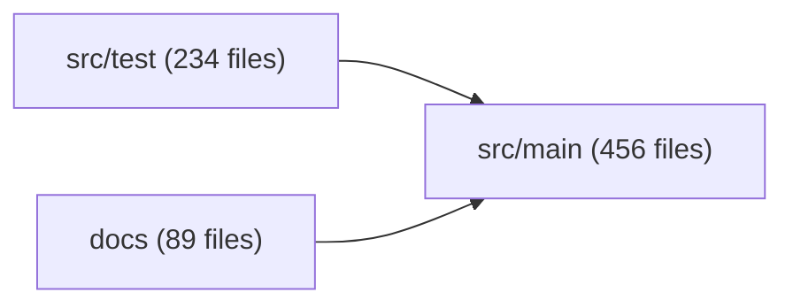

# Synthesis Quick Start Guide
**Get up and running in 5 minutes**

---

## What is Synthesis?

**Synthesis is your AI-powered knowledge infrastructure** that transforms your codebase and documentation into an intelligent, searchable knowledge graph.

**In simple terms:** It's like having a search engine for your entire project - code, docs, videos, PDFs, everything - with relationship mapping showing how files connect.

---

## Installation (30 seconds)

**Requirements:** Java 17+ (check with `java -version`)

**Install:**
```bash
# Download synthesis.jar (136 MB)
curl -L https://github.com/exoreaction/Synthesis/releases/latest/download/synthesis.jar -o synthesis.jar

# Create alias for convenience
alias synthesis='java -jar /path/to/synthesis.jar'
```

**Verify:**
```bash
synthesis --version
# Output: Synthesis 1.0.3-SNAPSHOT
```

---

## Your First 3 Commands (3 minutes)

### 1. Initialize Your Workspace

```bash
cd ~/your-project
synthesis init
```

**What it does:** Creates `.synthesis/` directory with configuration and index storage.

**Output:**
```
✓ Workspace initialized: /home/you/your-project
ℹ Config: .synthesis/config.yaml
ℹ Index:  .synthesis/index

Next steps:
  1. Run 'synthesis scan' to index your workspace
  2. Run 'synthesis search <query>' to find files
```

---

### 2. Scan Your Project

```bash
synthesis scan
```

**What it does:** Walks your directory tree, analyzes files, builds searchable index.

**What it indexes:**
- **Code:** .java, .py, .js, .ts, .go, .rs, .kt, .scala, .c, .cpp, .cs, .php, .rb, .sh
- **Docs:** .md, .pdf, .txt
- **Config:** .yaml, .json, .toml, .xml
- **Media:** .png, .jpg, .svg, .mp4, .mov, .mp3

**Output:**
```
========================================
  Synthesis - Scan Workspace
========================================

Phase 1: Scanning directory tree...
  Scanning [==============================] 100% (1,234/1,234)

Phase 2: Analyzing files and building index...
  Indexing [==============================] 100% (987/987)

Scan Summary
========================================
  Files discovered:    987
  Files indexed:       987
  Total size:          45.2 MB
  Scan duration:       2.3s

File types:
  CODE            623 files
  MARKDOWN        234 files
  JSON            89 files
  YAML            41 files

Languages:
  Java            456 files
  Python          123 files
  JavaScript      44 files
```

**Time:** 2-30 seconds depending on project size.

---

### 3. Search for Anything

```bash
synthesis search "authentication"
```

**Output:**
```
  20 results for: authentication

  1. [CODE] src/main/java/com/app/AuthService.java
     Java source, 234 lines of code
     15.2 KB | Java | CODE

  2. [MD]   docs/security/authentication.md
     Authentication and Authorization Guide
     8.4 KB | MARKDOWN

  3. [CODE] src/test/java/com/app/AuthServiceTest.java
     Java source, 89 lines of code
     5.1 KB | Java | CODE

  4. [YAML] config/auth-config.yaml
     YAML configuration with keys: auth, jwt, oauth
     1.2 KB | YAML
```

**Pro tip:** Be specific for better results:
```bash
synthesis search "JWT authentication"
synthesis search "user login flow"
synthesis search "EventStoreService"
```

---

## 🎉 You're Done!

You now have:
- ✅ A fully indexed workspace
- ✅ Fast search across all file types
- ✅ Foundation for relationship mapping and graphs

**Time invested:** 3-5 minutes
**Time saved:** Hours every week finding things

---

## What's Next? (Optional)

### See File Relationships

```bash
# Show what connects to a file (bi-directional)
synthesis relate "AuthService.java"
```

**Output shows:**
- **Outgoing:** Files this imports/references
- **Incoming:** Files that import/reference this (impact analysis!)

**Example:**
```
Relationships for: src/main/java/com/app/AuthService.java

Imports/References (outgoing): 5 files
  → UserRepository.java
  → TokenService.java
  → PasswordEncoder.java

Referenced by (incoming): 8 files
  ← AuthController.java
  ← LoginService.java
  ← AuthServiceTest.java
  ... 5 more

Total connections: 13
```

**Use case:** "What will break if I change this file?" → See all incoming references!

---

### Visualize Architecture

```bash
# Generate module dependency graph
synthesis graph --modules --format mermaid
```

**Output:**


**Save to file:**
```bash
synthesis graph --modules --format mermaid > architecture.md
```

Now you have an **auto-generated architecture diagram** that updates with your code!

---

### Check Workspace Status

```bash
synthesis status
```

**Shows:**
- Number of files indexed
- Last scan time
- File type breakdown
- Media support (videos, images, PDFs)
- Index size

**Example output:**
```
  Workspace:           my-project
  Index status:        Active
  Documents indexed:   987
  Last scan:           2026-02-14 17:45:23 (2 min ago)

  File types:
    CODE            623 files
    MARKDOWN        234 files
    PDF             45 files
    IMAGE           38 files
    VIDEO           3 files
```

---

## Daily Workflow

### Morning: Update Index

```bash
cd ~/project
synthesis scan  # Incremental - only scans changed files
```

**Takes:** 1-5 seconds (only processes new/modified files)

---

### Throughout the Day: Search Everything

```bash
# Find code
synthesis search "payment processing"

# Find docs
synthesis search "API documentation"

# Find config
synthesis search "database connection"

# Find media
synthesis search "architecture diagram"
```

---

### Before Refactoring: Check Impact

```bash
# See what depends on a file
synthesis relate "DatabaseConnection.java"

# Generate impact graph
synthesis graph DatabaseConnection.java --depth 2 --format mermaid
```

**Result:** You know **exactly** what to test before making changes.

---

## Essential Tips

### 1. Create a Shell Alias

**Add to `~/.bashrc` or `~/.zshrc`:**
```bash
alias syn='java -jar ~/bin/synthesis.jar'
```

**Usage:**
```bash
syn scan
syn search "query"
syn relate "File.java"
```

---

### 2. Customize for Your Project

**Edit `.synthesis/config.yaml`:**

**Python project:**
```yaml
scan:
  includePatterns:
    - "**/*.py"
    - "**/*.ipynb"
    - "requirements.txt"
  excludePatterns:
    - "**/__pycache__/**"
    - "**/.venv/**"
```

**JavaScript/Node project:**
```yaml
scan:
  includePatterns:
    - "**/*.js"
    - "**/*.jsx"
    - "**/*.ts"
    - "**/*.tsx"
    - "package.json"
  excludePatterns:
    - "**/node_modules/**"
    - "**/dist/**"
```

**Documentation project:**
```yaml
scan:
  includePatterns:
    - "**/*.md"
    - "**/*.pdf"
    - "**/*.png"
    - "**/*.jpg"
  maxFileSizeBytes: 52428800  # 50 MB for images/PDFs
```

---

### 3. When to Re-scan

**Automatic (incremental) scan after:**
- Pulling from git (`git pull`)
- Adding new files
- Changing existing files
- Switching branches

**Just run:** `synthesis scan` (fast, only processes changes)

**Full rebuild (rarely needed):**
```bash
synthesis scan --full
```

**When to full rebuild:**
- Changed config include/exclude patterns
- Moved/renamed many files
- Index corruption (very rare)

---

## Common Use Cases

### Use Case 1: "Where is the authentication code?"

```bash
synthesis search "authentication"
```

**Result:** All auth-related files in 1 second.

---

### Use Case 2: "What calls this function?"

```bash
synthesis relate "processPayment"
```

**Result:** All incoming references (callers).

---

### Use Case 3: "Show me the architecture"

```bash
synthesis graph --modules --format mermaid > architecture.md
```

**Result:** Auto-generated architecture diagram.

---

### Use Case 4: "Find all TODOs"

```bash
synthesis search "TODO"
synthesis search "FIXME"
synthesis search "@Deprecated"
```

**Result:** Technical debt inventory.

---

### Use Case 5: "What videos do we have?"

```bash
synthesis search "video"
```

**Result:** All videos with metadata (duration, resolution).

**Example output:**
```
  1. [VID] demos/product-demo.mp4
     Video file: product-demo.mp4 (MP4, 45.2 MB) [12m 34s] 1920x1080
```

---

## Troubleshooting

### "Not a Synthesis workspace"

**Solution:**
```bash
synthesis init  # Run this first!
```

---

### No search results

**Check 1:** Did you scan?
```bash
synthesis scan
```

**Check 2:** Are files included?
```bash
# Edit .synthesis/config.yaml
scan:
  includePatterns:
    - "**/*.java"  # Add your file types
```

---

### Slow scanning

**Solution:** Exclude build artifacts:
```yaml
scan:
  excludePatterns:
    - "**/node_modules/**"
    - "**/target/**"
    - "**/build/**"
    - "**/.venv/**"
```

---

## What Makes Synthesis Special?

### 1. Batteries Included 🔋

**No dependencies to install:**
- ✅ Video metadata extraction (bundled ffprobe)
- ✅ PDF full-text search
- ✅ Image analysis
- ✅ Code parsing (all languages)

**Works offline** - no cloud, no API keys (for core features).

---

### 2. Intelligent Relationships 🕸️

**Bi-directional tracking:**
- See what a file imports (outgoing)
- See what imports a file (incoming)

**Example:**
```
AuthService.java:
  → imports: TokenService, UserRepository
  ← used by: AuthController, LoginService, AuthServiceTest
```

**Use case:** Impact analysis before refactoring.

---

### 3. Multi-Format Search 🔍

**One search finds:**
- Code files
- Documentation (markdown, PDFs)
- Configuration (YAML, JSON)
- Media (videos, images)

**No more:** "Was it in the docs or the code?"

---

### 4. Visual Knowledge Graphs 📊

**Auto-generate:**
- Module dependency graphs
- File relationship diagrams
- Cross-repository dependencies

**Formats:** Mermaid, PNG, SVG, DOT

**Updates automatically** with your code.

---

### 5. Fast & Efficient ⚡

**Performance:**
- 200-500 files/second indexing
- Sub-second search across 10,000+ files
- 2-5% storage overhead (efficient Lucene index)

**Example:**
- 10,000 file codebase → 30 seconds to index
- 500 MB content → 10 MB index

---

## Getting Help

**Command help:**
```bash
synthesis --help
synthesis scan --help
synthesis search --help
synthesis graph --help
```

**Full guide:**
```bash
# Read USER-GUIDE.md for comprehensive documentation
```

**Community:**
- GitHub Issues: https://github.com/exoreaction/Synthesis/issues
- Discussions: https://github.com/exoreaction/Synthesis/discussions

---

## Quick Command Reference

```bash
# Setup
synthesis init                     # Initialize workspace

# Indexing
synthesis scan                     # Scan files (incremental)
synthesis scan --full              # Full rebuild
synthesis scan --verbose           # Show details

# Searching
synthesis search "query"           # Search everything
synthesis search "exact phrase"    # Multi-word search

# Relationships
synthesis relate <file>            # Show connections
synthesis relate <file> --mermaid  # Mermaid diagram

# Graphs
synthesis graph --modules --format mermaid    # Architecture
synthesis graph <file> --depth 2              # File graph

# Status
synthesis status                   # Workspace info
```

---

## 🚀 Next Steps

**You're ready to:**
1. ✅ Search your entire project in seconds
2. ✅ Map file relationships
3. ✅ Generate architecture diagrams
4. ✅ Analyze impact before refactoring

**Read the full guide:**
- `USER-GUIDE.md` - Comprehensive documentation
- Real-world use cases
- Advanced features
- Pro tips & workflows

**Start exploring:**
```bash
synthesis search "your first query"
```

---

**Welcome to Synthesis!** 🎉

Your codebase just got a lot more navigable.
