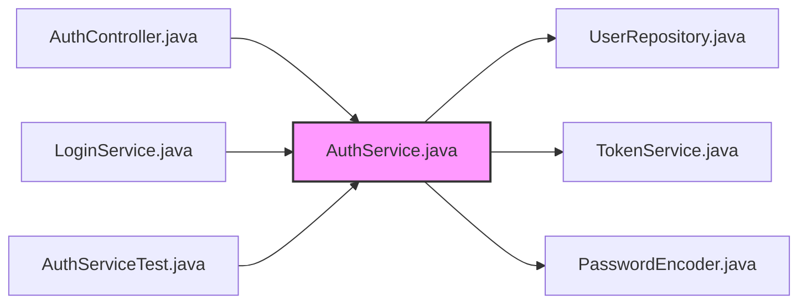

# Synthesis User Guide
**Your AI-Powered Knowledge Infrastructure**

> *"Transform your codebase and documentation into an intelligent, searchable knowledge graph that reveals the hidden structure and relationships in your work."*

---

## Table of Contents

1. [Introduction: Why Synthesis?](#introduction-why-synthesis)
2. [Getting Started in 5 Minutes](#getting-started-in-5-minutes)
3. [Core Concepts](#core-concepts)
4. [Essential Commands](#essential-commands)
5. [Advanced Features](#advanced-features)
6. [Real-World Use Cases](#real-world-use-cases)
7. [Pro Tips & Workflows](#pro-tips--workflows)
8. [Troubleshooting](#troubleshooting)
9. [FAQ](#faq)

---

## Introduction: Why Synthesis?

### The Problem

Modern software development generates vast amounts of knowledge scattered across multiple locations:
- **Source code** in dozens of repositories
- **Documentation** in markdown files, PDFs, wikis
- **Media** like architecture diagrams, demo videos, presentations
- **Configuration** in YAML, JSON, and property files

Finding information requires:
- Remembering which repository contains what
- Grepping through thousands of files
- Manually tracking dependencies and relationships
- Switching between tools (IDE, file browser, grep, documentation sites)

### The Solution: Synthesis

**Synthesis is your AI-powered knowledge infrastructure** that:

✨ **Indexes everything** - Code, docs, videos, images, PDFs - in seconds
🔍 **Searches intelligently** - Natural language queries across all formats
🕸️ **Maps relationships** - Bi-directional links showing how files connect
📊 **Visualizes structure** - Knowledge graphs revealing architecture
🎯 **Finds impact** - "What will break if I change this file?"
⚡ **Works offline** - No cloud dependencies, no API keys required (for core features)

**Batteries included:** Video metadata extraction, PDF analysis, code parsing, and graph visualization work out-of-the-box.

---

## Getting Started in 5 Minutes

### Installation

**Requirements:**
- Java 17+ (tested with Java 24)
- 150 MB disk space (for the JAR)
- Linux, macOS, or Windows

**Download:**
```bash
# Download synthesis.jar (136 MB)
curl -L https://github.com/exoreaction/Synthesis/releases/latest/download/synthesis.jar -o synthesis.jar

# Or use the installation script
curl -sSL https://synthesis.exoreaction.io/install.sh | bash
```

**Verify installation:**
```bash
java -jar synthesis.jar --version
# Output: Synthesis 1.0.3-SNAPSHOT
```

### Quick Start

**1. Initialize your workspace:**
```bash
cd ~/my-project
java -jar synthesis.jar init
```

**Output:**
```
✓ Workspace initialized: /home/you/my-project
ℹ Config: /home/you/my-project/.synthesis/config.yaml
ℹ Index:  /home/you/my-project/.synthesis/index

Next steps:
  1. Run 'synthesis scan' to index your workspace
  2. Run 'synthesis search <query>' to find files
```

**2. Scan your workspace:**
```bash
java -jar synthesis.jar scan
```

**Output:**
```
========================================
  Synthesis - Scan Workspace
========================================

Phase 1: Scanning directory tree...
  Scanning [==============================] 100% (1,234/1,234)

Phase 2: Analyzing files and building index...
  Indexing [==============================] 100% (987/987)

Scan Summary
========================================
  Files discovered:    987
  Files indexed:       987
  Total size:          45.2 MB
  Scan duration:       2.3s

File types:
  CODE            623 files
  MARKDOWN        234 files
  JSON            89 files
  YAML            41 files
```

**3. Search for anything:**
```bash
java -jar synthesis.jar search "authentication"
```

**Output:**
```
  20 results for: authentication

  1. [CODE] src/main/java/com/app/AuthService.java
     Java source, 234 lines of code
     15.2 KB | Java | CODE

  2. [MD]   docs/security/authentication.md
     Authentication and Authorization Guide
     8.4 KB | MARKDOWN

  3. [YAML] config/auth-config.yaml
     YAML configuration with keys: auth, jwt, oauth
     1.2 KB | YAML
```

**🎉 Congratulations!** You've indexed and searched your first workspace.

---

## Core Concepts

### Workspaces

A **workspace** is any directory containing code, documentation, or media you want to search and analyze.

**Key points:**
- One workspace = one `.synthesis/` directory
- Multiple workspaces supported (run Synthesis from each directory)
- Each workspace has its own index and configuration

**Example:**
```
~/my-project/           ← Workspace 1
  .synthesis/
    config.yaml
    index/
  src/
  docs/

~/another-project/      ← Workspace 2
  .synthesis/
  code/
```

### Index

The **index** is a Lucene-based database that stores:
- File metadata (path, size, type, language)
- Searchable content (text from files)
- Relationships (imports, references)
- Media metadata (video duration, image dimensions, PDF pages)

**Characteristics:**
- Typically 2-5% of original content size
- Fast: Sub-second searches across thousands of files
- Persistent: Survives restarts, no re-scanning needed
- Incremental: Run `synthesis scan` anytime to update

### File Types

Synthesis understands many file types:

| Category | Extensions | Features |
|----------|-----------|----------|
| **Code** | .java, .py, .js, .ts, .go, .rs, .kt, etc. | Language detection, import tracking |
| **Markdown** | .md, .markdown | Link extraction, section parsing |
| **Config** | .yaml, .yml, .json, .toml, .xml | Structure analysis |
| **Documents** | .pdf | Full-text search, presentation detection |
| **Images** | .png, .jpg, .svg, .webp | Dimension extraction, classification |
| **Videos** | .mp4, .mov, .avi, .mkv, .webm | Duration, resolution, format |
| **Audio** | .mp3, .wav, .flac, .ogg | Metadata extraction |

### Relationships

Synthesis tracks how files relate to each other:

**Relationship types:**
- **Imports** - Java `import`, Python `import`, JS/TS `require()`
- **References** - Markdown links `[text](file.md)`, quoted paths `"config.yaml"`
- **Dependencies** - Module-to-module, repo-to-repo

**Bi-directional tracking:**
- **Outgoing:** What does this file import/reference?
- **Incoming:** What imports/references this file?

---

## Essential Commands

### `synthesis init` - Initialize Workspace

**Purpose:** Create `.synthesis/` directory and configuration.

**Usage:**
```bash
synthesis init
```

**What it does:**
1. Creates `.synthesis/config.yaml` with default settings
2. Creates `.synthesis/index/` directory for Lucene index
3. Detects workspace type (general, monorepo, documentation)
4. Generates unique UUID for telemetry

**Configuration file** (`.synthesis/config.yaml`):
```yaml
workspace:
  name: "my-project"
  type: "general"

scan:
  includePatterns:
    - "**/*.md"
    - "**/*.java"
    - "**/*.py"
    # ... more patterns

  excludePatterns:
    - "**/node_modules/**"
    - "**/.git/**"
    - "**/target/**"

  maxFileSizeBytes: 10485760  # 10 MB

search:
  maxResults: 20
  previewLength: 200

ai:
  enabled: false  # Set to true + ANTHROPIC_API_KEY for AI features
```

---

### `synthesis scan` - Index Your Workspace

**Purpose:** Scan files and build searchable index.

**Usage:**
```bash
synthesis scan                    # Incremental scan (default)
synthesis scan --full             # Full rebuild (delete existing index)
synthesis scan --verbose          # Show detailed progress
synthesis scan --with-readme      # Generate README.md files (requires AI)
```

**What it does:**
1. **Phase 1:** Walks directory tree, discovers files
2. **Phase 2:** Analyzes each file:
   - Extracts metadata (size, type, language)
   - Reads content (text files)
   - Extracts media metadata (videos, images, PDFs)
   - Detects relationships (imports, links)
3. **Phase 3:** Builds Lucene index for fast search

**Performance:**
- Small projects (<1,000 files): <1 second
- Medium projects (1,000-10,000 files): 5-30 seconds
- Large codebases (10,000+ files): 30-120 seconds
- Throughput: 200-500 files/second (depends on content)

**Example output:**
```bash
$ synthesis scan --verbose

========================================
  Synthesis - Scan Workspace
========================================

ℹ Workspace: my-project
ℹ Root: /home/you/my-project

Phase 1: Scanning directory tree...
  Scanning [==============================] 100% (2,456/2,456)
  Scanning complete: 2,456 items in 1s

📹 Found 3 video/audio files
✅ bundled ffprobe - full video format support

Phase 2: Analyzing files and building index...
  Indexing [==============================] 100% (1,987/1,987)

  ✓ demo-video.mp4 (metadata_extractor: 5h 23m, 1920x1080)
  ✓ architecture-diagram.svg (vector: 1200x800)
  ✓ whitepaper.pdf (18 pages)

  Indexing complete: 1,987 items in 12s

Scan Summary
========================================
  Files discovered:    1,987
  Files indexed:       1,987
  Total size:          124.5 MB
  Scan duration:       2.1s

File types:
  CODE            1,234 files
  MARKDOWN        456 files
  JSON            178 files
  PDF             45 files
  IMAGE           38 files
  VIDEO           3 files
  YAML            33 files

Languages:
  Java            856 files
  JavaScript      234 files
  Python          89 files
  Shell           55 files
```

**Pro tip:** Run `synthesis scan` after pulling updates, adding files, or when search results seem outdated.

---

### `synthesis search` - Find Anything

**Purpose:** Search across all indexed files.

**Usage:**
```bash
synthesis search "query"                  # Basic search
synthesis search "authentication jwt"     # Multi-word search
synthesis search "EventStore"             # Case-sensitive class names work
```

**Search behavior:**
- **Fuzzy matching:** Finds similar terms (authentication → authenticate)
- **Multi-word:** Ranks results by relevance
- **Case-insensitive:** Unless you use uppercase (EventStore → exact)
- **File type filtering:** Code files ranked higher for code terms
- **Snippet preview:** Shows context around matches

**Example:**
```bash
$ synthesis search "temporal analytics"

  20 results for: temporal analytics

  1. [PDF] docs/whitepapers/temporal-analytics-whitepaper.pdf
     PDF document: Temporal Analytics Maturity Model (12 pages)
     234.5 KB | PDF

  2. [MD]  docs/architecture/temporal-data-model.md
     Temporal Data Architecture
     15.2 KB | MARKDOWN

  3. [CODE] src/analytics/TemporalAnalyzer.java
     Java source, 456 lines of code
     23.1 KB | Java | CODE

  4. [YAML] config/analytics-config.yaml
     YAML configuration with keys: temporal, analytics, streams
     2.1 KB | YAML
```

**Result details:**
- **Rank:** Most relevant first
- **Type indicator:** [CODE], [MD], [PDF], [IMG], [VID], [YAML], [JSON]
- **Title/description:** File name or extracted title
- **Preview:** Summary or content snippet
- **Metadata:** Size, file type, language

**Pro tip:** Use specific technical terms for better results. "JWT authentication flow" is better than "login".

---

### `synthesis status` - Workspace Status

**Purpose:** View workspace information and health.

**Usage:**
```bash
synthesis status
```

**Output:**
```
========================================
  Synthesis - Workspace Status
========================================

  Workspace:           my-project
  Type:                general
  Root:                /home/you/my-project

  Index status:        Active
  Documents indexed:   1,987
  Index size:          3.2 MB

  Last scan:           2026-02-14 17:45:23 (2 min ago)
  Files tracked:       1,987

  Media & Documents:
    Images:         38 files
    Videos:         3 files
    PDFs:           45 files (12 presentations, 33 documents)

  External Tools:
    ffprobe:        Bundled (FFmpeg 7.0.2)

  AI features:         Disabled
  Set ai.enabled=true and ANTHROPIC_API_KEY to enable.

  Telemetry:           Active (mandatory)
  Client UUID:         abc123...
  Pilot Status:        Pending Approval
```

**Use cases:**
- Check if workspace is properly initialized
- See when last scan was performed
- Verify media file support (ffprobe status)
- Check AI feature configuration

---

### `synthesis relate` - Find Relationships

**Purpose:** Show how a file relates to others (bi-directional).

**Usage:**
```bash
synthesis relate <filename>              # Show relationships
synthesis relate <filename> --depth 2    # Follow 2 levels deep
synthesis relate <filename> --mermaid    # Output Mermaid diagram
synthesis relate <filename> --verbose    # Detailed reference info
```

**Example:**
```bash
$ synthesis relate "AuthService.java"

  Relationships for: src/main/java/com/app/AuthService.java
  Language: Java | Type: CODE | Size: 15.2 KB

  Imports/References (outgoing): 5 files
    → UserRepository.java (imports/references)
    → TokenService.java (imports/references)
    → PasswordEncoder.java (imports/references)
    → AuthConfig.java (imports/references)
    → SecurityUtils.java (imports/references)

  Referenced by (incoming): 8 files
    ← AuthController.java (references)
    ← LoginService.java (references)
    ← RegisterService.java (references)
    ← AuthServiceTest.java (references)
    ← SecurityConfig.java (references)
    ← AuthenticationFilter.java (references)
    ← SessionManager.java (references)
    ← PasswordResetService.java (references)

  Total connections: 13
```

**Mermaid diagram:**
```bash
$ synthesis relate "AuthService.java" --mermaid


```

**Use cases:**
- **Impact analysis:** "What will break if I change this?"
- **Code navigation:** "What depends on this service?"
- **Refactoring safety:** See all incoming references before changing APIs
- **Onboarding:** Understand how modules connect

---

### `synthesis graph` - Visualize Knowledge Graphs

**Purpose:** Generate visual knowledge graphs showing architecture and dependencies.

**Usage:**
```bash
# Module/directory dependency graph
synthesis graph --modules --format mermaid

# Cross-repository dependency graph
synthesis graph --cross-repo --format png --output deps.png

# File relationships (centered on specific file)
synthesis graph README.md --depth 2 --format svg

# All files (use with caution for large projects)
synthesis graph --all --format mermaid
```

**Graph types:**

**1. Module Graph** (Recommended for overview)
```bash
$ synthesis graph --modules --format mermaid

Graph: Module dependency graph
Nodes: 15
Edges: 23

```mermaid
graph LR
    src_main["src/main (456 files)"]
    src_test["src/test (234 files)"]
    docs["docs (89 files)"]
    config["config (23 files)"]

    src_test --> src_main
    docs --> src_main
    config --> src_main

    style src_main fill:#2C3E50,stroke:#333,stroke-width:2px
```


```

**2. File Relationship Graph**
```bash
$ synthesis graph UserService.java --depth 1 --format mermaid
```

Shows:
- The target file (highlighted)
- All files it references (outgoing arrows)
- All files that reference it (incoming arrows)
- Configurable depth (1-5 levels)

**3. Cross-Repository Graph**
```bash
$ synthesis graph --cross-repo --format png --output repo-deps.png
```

Perfect for:
- Multi-repo monorepos
- Microservices architectures
- Understanding ecosystem dependencies

**Output formats:**
- **Mermaid** - Markdown-embeddable, GitHub-compatible (default)
- **PNG** - Raster image (requires Graphviz)
- **SVG** - Vector image (requires Graphviz)
- **DOT** - Graphviz source code

**Pro tip:** Start with `--modules` for high-level architecture, then drill down with specific file graphs.

---

### `synthesis enrich` - Generate Companion Files

**Purpose:** Generate `.synthesis.md` companion files for binary assets (images, videos, PDFs, audio) to make them fully text-searchable.

**Usage:**
```bash
synthesis enrich                       # Generate companions for all binary files
synthesis enrich --force               # Regenerate even if companions exist
synthesis enrich --type video          # Only for video files
synthesis enrich --type image          # Only for image files
synthesis enrich --level basic         # Force basic enrichment (no AI)
synthesis enrich --level ai            # Full AI enrichment (requires API key)
synthesis enrich --dry-run             # Show what would be generated
synthesis enrich --stats               # Show enrichment coverage statistics
```

**What it does:**
1. Scans the index for binary files (VIDEO, IMAGE, PDF, AUDIO)
2. For each file, generates a `.synthesis.md` companion containing:
   - YAML front matter with metadata (type, size, format)
   - Extracted technical metadata (dimensions, duration, page count)
   - Related file references (subtitles, slides, associated docs)
   - AI descriptions (with `--level ai`)
3. Companion files are indexed by the next `synthesis scan`

**Enrichment levels:**

| Level | Description | Requires |
|-------|-------------|----------|
| `basic` | File metadata only (size, type, format) | Nothing |
| `local` | Metadata + local tool analysis (ffprobe, image dimensions) | Nothing |
| `ai` | Full enrichment including AI vision and content descriptions | `ANTHROPIC_API_KEY` |

**Example output:**
```bash
$ synthesis enrich

========================================
  Synthesis - Enrich Binary Assets
========================================

  Processing binary files...
    [==============================] 100% (45/45)

  Generated:  38 companion files
  Skipped:     5 (already enriched)
  Errors:      2 (file access issues)
  Level:       BASIC
  Duration:    3.2s

  Run 'synthesis scan' to index the new companion files.
```

**Companion file example** (`demo.mp4.synthesis.md`):
```markdown
---
companion_for: demo.mp4
type: VIDEO
enrichment_level: BASIC
generated: 2026-02-15T10:30:00Z
---

# demo.mp4

**Type:** VIDEO | **Size:** 45.2 MB

## Technical Metadata
- Duration: 5:30
- Resolution: 1080p
- Codec: H.264

## Description
A demo video.

## Related Files
- `demo.srt` (subtitle/transcript)
- `demo-slides.pdf` (slides)
```

---

### `synthesis explain` - AI Code Explanation

**Purpose:** Generate AI-powered explanations of files, modules, or architectural patterns.

**Usage:**
```bash
synthesis explain --file src/auth/Login.java           # Explain a file
synthesis explain --module src/auth/                    # Explain a module/directory
synthesis explain --pattern "authentication"            # Explain a concept/pattern
synthesis explain --file Login.java --depth deep        # Deep dive analysis
synthesis explain --file Login.java --depth brief       # Quick 3-5 sentence summary
synthesis explain --file Login.java --format json       # Machine-readable output
synthesis explain --file Login.java --format markdown   # Markdown output
```

**Requires:** `ANTHROPIC_API_KEY` environment variable.

**Modes:**

| Mode | Flag | Description |
|------|------|-------------|
| File | `--file` | Explains a single file: purpose, structure, relationships |
| Module | `--module` | Explains a directory: role, internal structure, dependencies |
| Pattern | `--pattern` | Explains a concept: how it is implemented across the codebase |

**Depths:**

| Depth | Output | Best for |
|-------|--------|----------|
| `brief` | 3-5 sentences | Quick overview, code review |
| `standard` | Multiple sections with code references | Day-to-day understanding |
| `deep` | Comprehensive analysis with full context | Onboarding, documentation |

**Example:**
```bash
$ synthesis explain --file src/auth/AuthService.java --depth standard

========================================
  Synthesis - Explain
========================================

  Mode:     File
  Target:   src/auth/AuthService.java
  Depth:    STANDARD
  Context:  8 related files

  ## AuthService.java

  This is the core authentication service that handles user login,
  token generation, and session management.

  ### Purpose
  AuthService acts as the central coordination point for all
  authentication flows in the application...

  ### Key Methods
  - `authenticate(credentials)` - Validates user credentials
  - `refreshToken(token)` - Generates new JWT from refresh token
  - `logout(sessionId)` - Invalidates session

  ### Relationships
  - Depends on: TokenManager, UserRepository, PasswordEncoder
  - Used by: LoginController, AuthenticationFilter

  Duration: 2.3s
```

---

### `synthesis architecture` - Architecture Intelligence

**Purpose:** Detect anti-patterns, coupling issues, and quality gaps in your codebase.

**Usage:**
```bash
synthesis architecture analyze                            # Full analysis
synthesis architecture analyze --severity warning         # Only warnings and errors
synthesis architecture analyze --category GOD_CLASS       # Filter by category
synthesis architecture analyze --format json              # JSON output
synthesis architecture analyze --limit 20                 # Limit results
```

**What it detects:**

| Category | Description | Severity |
|----------|-------------|----------|
| `GOD_CLASS` | Files with too many lines (>1000 warning, >2000 error) | WARNING/ERROR |
| `CIRCULAR_DEPENDENCY` | Circular import/reference chains | ERROR |
| `DEAD_CODE` | Files not referenced by any other file | INFO |
| `MISSING_DOCUMENTATION` | Directories with code but no README | WARNING |
| `TEST_COVERAGE_GAP` | Source files without corresponding test files | WARNING |
| `HIGH_COUPLING` | Files with excessive incoming references | WARNING |
| `FEATURE_ENVY` | Files that reference another module more than their own | INFO |

**Example:**
```bash
$ synthesis architecture analyze --severity warning

========================================
  Synthesis - Architecture Analysis
========================================

  Found 7 alerts: 2 errors, 3 warnings, 2 info (1.2s)

  GOD_CLASS (2)
    ERROR  src/legacy/MonolithService.java
           File has 2,450 lines (threshold: 1,000)
    WARN   src/utils/StringHelper.java
           File has 1,200 lines (threshold: 1,000)

  CIRCULAR_DEPENDENCY (1)
    ERROR  src/auth/AuthService.java -> src/user/UserService.java -> src/auth/AuthService.java
           Circular dependency chain detected

  MISSING_DOCUMENTATION (2)
    WARN   src/payment/
           Directory has 8 code files but no README
    WARN   src/notification/
           Directory has 5 code files but no README

  TEST_COVERAGE_GAP (2)
    WARN   src/payment/PaymentProcessor.java
           No test file found (expected PaymentProcessorTest.java)
    WARN   src/notification/EmailSender.java
           No test file found (expected EmailSenderTest.java)
```

**JSON output:**
```bash
$ synthesis architecture analyze --format json
{
  "totalAlerts": 7,
  "durationMs": 1200,
  "alerts": [
    {
      "severity": "ERROR",
      "category": "GOD_CLASS",
      "filePath": "src/legacy/MonolithService.java",
      "message": "File has 2,450 lines (threshold: 1,000)"
    }
  ]
}
```

**Daemon mode integration:** When running `synthesis watch`, architecture analysis runs automatically on changed code files and reports alerts in verbose mode.

**LSP integration:** The LSP server publishes architecture alerts as diagnostics. In your IDE, you will see architecture issues as warnings/errors in the Problems panel.

---

### `synthesis search --semantic` - Semantic Search

**Purpose:** Search by meaning rather than keywords using embedding-based similarity.

**Usage:**
```bash
synthesis search "how errors are handled" --semantic                    # Semantic search
synthesis search "database connection management" --semantic --limit 10 # With limit
synthesis search "retry logic" --semantic --similarity-threshold 0.5    # Higher threshold
```

**How it works:**
1. Generates a vector embedding of your query (256 dimensions)
2. Compares against embeddings of indexed file content
3. Returns files ranked by cosine similarity (meaning-based)
4. Falls back to local TF-IDF embeddings when no OpenAI API key is set

**Parameters:**

| Parameter | Description | Default |
|-----------|-------------|---------|
| `--semantic` | Enable semantic search mode | `false` |
| `--similarity-threshold` | Minimum similarity score (0.0-1.0) | `0.3` |

**When to use semantic vs keyword search:**

| Use Case | Keyword Search | Semantic Search |
|----------|---------------|-----------------|
| Exact class/method name | Better | -- |
| Concept or behavior | -- | Better |
| "How does X work?" | -- | Better |
| Finding specific error messages | Better | -- |
| Finding related implementations | -- | Better |

**Example:**
```bash
$ synthesis search "how authentication tokens are refreshed" --semantic

  5 results (semantic, threshold: 0.3)

  1. [CODE] src/auth/TokenRefresher.java          (similarity: 0.87)
     Token refresh logic with expiration handling
     12.3 KB | Java | CODE

  2. [CODE] src/auth/JwtTokenManager.java          (similarity: 0.72)
     JWT token generation and validation
     8.1 KB | Java | CODE

  3. [MD]   docs/auth/token-lifecycle.md            (similarity: 0.65)
     Token lifecycle documentation
     4.2 KB | MARKDOWN
```

---

## Advanced Features

### Media Support (Batteries Included)

Synthesis includes **bundled ffprobe** for video metadata extraction. No installation required!

**Supported formats:**

**Videos:**
- MP4, MOV, AVI (via pure Java metadata-extractor - fastest)
- MKV, WebM, FLV (via bundled ffprobe)

**Images:**
- PNG, JPG, JPEG, GIF, WebP (dimensions, format)
- SVG (vector, text/shapes detection)
- TIFF, BMP, HEIC (basic metadata)

**Audio:**
- MP3, WAV, FLAC, OGG, AAC (duration, bitrate)

**Documents:**
- PDF (full-text search, page count, presentation detection)

**Example search:**
```bash
$ synthesis search "demo"

  1. [VID] videos/product-demo.mp4
     Video file: product-demo.mp4 (MP4, 45.2 MB) [12m 34s] 1920x1080
     45.2 MB | VIDEO

  2. [PDF] presentations/demo-slides.pdf
     PDF presentation: Product Demo Slides (24 pages)
     2.3 MB | PDF
```

**Configuration:**

Adjust media file patterns in `.synthesis/config.yaml`:
```yaml
scan:
  includePatterns:
    # Images
    - "**/*.png"
    - "**/*.jpg"
    - "**/*.svg"

    # Videos
    - "**/*.mp4"
    - "**/*.mov"
    - "**/*.mkv"

    # Audio
    - "**/*.mp3"
    - "**/*.wav"

  # Increase for large videos (default: 10 MB)
  maxFileSizeBytes: 104857600  # 100 MB
```

**Video metadata extraction:**

Synthesis uses a **two-tier strategy**:
1. **Primary:** Pure Java library (metadata-extractor) - covers MP4/MOV/AVI (~90% of videos)
2. **Fallback:** Bundled ffprobe - covers MKV/WebM and edge cases

**First use:** Synthesis automatically extracts ffprobe to `~/.synthesis/bin/ffprobe` (76 MB on Linux, one-time extraction).

---

### AI-Powered Features

Enable AI features with Claude API for advanced capabilities.

**Setup:**
```bash
# Set API key
export ANTHROPIC_API_KEY="sk-ant-..."

# Enable in config
synthesis init  # Edit .synthesis/config.yaml
```

**Config:**
```yaml
ai:
  enabled: true
  model: "claude-sonnet-4-5-20250929"
  readmeGeneration: true
  contentSummary: true
  maxTokens: 1024
```

**Features:**

**1. README Generation**
```bash
synthesis scan --with-readme
```
- Analyzes directory contents
- Generates comprehensive README.md files
- Includes purpose, structure, getting started

**2. Image Description (Vision)**
```bash
# Automatically enabled for image files
synthesis scan
```
- Describes UI screenshots
- Extracts text from diagrams
- Identifies visual content

**3. Directed Synthesis**
```bash
synthesis search "architecture patterns" --synthesize
```
- Generates analytical perspectives
- Compares approaches
- Identifies gaps

**Cost:** ~$0.01-0.04 per image, varies by model and content.

---

### Multi-Workspace Workflows

**Use case:** Multiple projects, shared Synthesis binary.

**Setup:**
```bash
# Single JAR in ~/bin/
cp synthesis.jar ~/bin/
export PATH="$HOME/bin:$PATH"

# Alias for convenience
alias syn='java -jar ~/bin/synthesis.jar'
```

**Workflow:**
```bash
# Project 1
cd ~/work/project-a
syn scan
syn search "authentication"

# Project 2
cd ~/work/project-b
syn scan
syn search "authentication"

# Project 3
cd ~/work/docs
syn scan
syn search "authentication"
```

Each workspace maintains its own index. Same binary, multiple workspaces.

**Bundled ffprobe reuse:** Extracted once to `~/.synthesis/bin/ffprobe`, shared across all workspaces.

---

### Configuration Deep Dive

**Location:** `.synthesis/config.yaml`

**Full example:**
```yaml
workspace:
  name: "my-project"
  type: "general"  # or "monorepo", "documentation"
  description: "My awesome project"

scan:
  # Files to include
  includePatterns:
    # Code
    - "**/*.java"
    - "**/*.py"
    - "**/*.js"
    - "**/*.ts"
    - "**/*.go"
    - "**/*.rs"

    # Docs
    - "**/*.md"
    - "**/*.pdf"

    # Config
    - "**/*.yaml"
    - "**/*.json"
    - "**/*.toml"

    # Media
    - "**/*.png"
    - "**/*.jpg"
    - "**/*.mp4"
    - "**/*.svg"

  # Files to exclude
  excludePatterns:
    - "**/node_modules/**"
    - "**/.git/**"
    - "**/target/**"      # Maven
    - "**/build/**"       # Gradle
    - "**/__pycache__/**" # Python
    - "**/.venv/**"       # Python virtualenv
    - "**/.synthesis/**"  # Synthesis data

  # Compute MD5 hashes for duplicate detection
  computeHashes: true

  # Skip files larger than this
  maxFileSizeBytes: 10485760  # 10 MB (increase for videos)

search:
  maxResults: 20           # Maximum results to show
  previewLength: 200       # Characters in preview
  contentPreviewBytes: 10240  # Bytes to preview (10 KB)

ai:
  enabled: false
  model: "claude-sonnet-4-5-20250929"
  readmeGeneration: true
  contentSummary: false
  maxTokens: 1024
```

**Customize for your project:**

**Python project:**
```yaml
scan:
  includePatterns:
    - "**/*.py"
    - "**/*.ipynb"
    - "**/*.md"
    - "requirements.txt"
    - "pyproject.toml"
  excludePatterns:
    - "**/__pycache__/**"
    - "**/.venv/**"
    - "**/.pytest_cache/**"
```

**Documentation site:**
```yaml
scan:
  includePatterns:
    - "**/*.md"
    - "**/*.mdx"
    - "**/*.pdf"
    - "**/*.png"
    - "**/*.jpg"
    - "**/*.svg"
  excludePatterns:
    - "**/node_modules/**"
    - "**/.next/**"
```

**Video/media project:**
```yaml
scan:
  includePatterns:
    - "**/*.mp4"
    - "**/*.mov"
    - "**/*.avi"
    - "**/*.mkv"
    - "**/*.mp3"
    - "**/*.pdf"
  maxFileSizeBytes: 524288000  # 500 MB
```

---

## Real-World Use Cases

### Use Case 1: Codebase Onboarding

**Scenario:** New developer joins your team, needs to understand a 10,000-file codebase.

**Workflow:**
```bash
# 1. Initialize and scan
cd ~/company/main-repo
synthesis init
synthesis scan

# 2. Get high-level overview
synthesis graph --modules --format mermaid > architecture.md

# 3. Find authentication code
synthesis search "authentication"

# 4. Understand AuthService
synthesis relate "AuthService.java"

# 5. See what calls AuthService
synthesis search "AuthService" --references
```

**Result:** Developer understands architecture in 30 minutes vs 3 days of code reading.

---

### Use Case 2: Impact Analysis Before Refactoring

**Scenario:** You want to change `UserRepository.java`. What will break?

**Workflow:**
```bash
# 1. Find all incoming references
synthesis relate "UserRepository.java"

# Output shows 23 files reference it:
#   ← UserService.java
#   ← AdminService.java
#   ← ReportService.java
#   ... 20 more

# 2. Check specific reference
synthesis search "UserRepository" | grep Service

# 3. Generate impact graph
synthesis graph UserRepository.java --depth 2 --format svg --output impact.svg
```

**Result:** You know exactly what to test before making changes. Zero surprises.

---

### Use Case 3: Documentation Maintenance

**Scenario:** 500 markdown files, PDFs, videos. Which docs mention "deprecated API"?

**Workflow:**
```bash
# 1. Scan docs directory
cd ~/company/docs
synthesis init
synthesis scan

# 2. Find all mentions
synthesis search "deprecated API"

# Result:
#   1. [MD] guides/migration-v1-to-v2.md
#   2. [PDF] api-changelog.pdf (page 15)
#   3. [MD] troubleshooting/common-errors.md
#   4. [VID] webinar-2024-api-changes.mp4

# 3. Find cross-references
synthesis relate "migration-v1-to-v2.md"

# Shows which docs link to migration guide
```

**Result:** Found 4 docs to update in 30 seconds vs 2 hours of manual searching.

---

### Use Case 4: Multi-Repository Dependency Analysis

**Scenario:** 15 microservices, need to understand cross-service dependencies.

**Workflow:**
```bash
# 1. Scan all services (one workspace)
cd ~/company/microservices
synthesis init
synthesis scan

# 2. Generate cross-repo graph
synthesis graph --cross-repo --format png --output services-deps.png

# 3. Find circular dependencies
synthesis graph --cross-repo --format mermaid | grep -A5 "→.*→"

# 4. Analyze specific service
synthesis relate "payment-service/PaymentController.java"
```

**Result:** Visual map of all inter-service dependencies. Circular dependencies highlighted.

---

### Use Case 5: Technical Debt Discovery

**Scenario:** Find all TODO comments, deprecated code, technical debt markers.

**Workflow:**
```bash
# 1. Search for debt markers
synthesis search "TODO"
synthesis search "FIXME"
synthesis search "HACK"
synthesis search "@Deprecated"

# 2. Find related files
synthesis relate "LegacyDatabase.java"

# Shows 45 files still depend on legacy database

# 3. Generate refactoring plan
synthesis graph LegacyDatabase.java --depth 3 --format mermaid
```

**Result:** Comprehensive technical debt inventory with dependency impact analysis.

---

### Use Case 6: Demo Preparation

**Scenario:** Need to find all demo videos, slides, and related code for client presentation.

**Workflow:**
```bash
# 1. Find demo materials
synthesis search "demo"

# Results:
#   [VID] demos/product-demo-2024.mp4 (12m 34s)
#   [PDF] slides/demo-presentation.pdf (24 pages)
#   [MD] docs/demo-script.md
#   [CODE] examples/DemoApplication.java

# 2. Check video metadata
synthesis status

# Shows:
#   Videos: 3 files
#   - product-demo-2024.mp4 (12m 34s, 1920x1080, 45 MB)

# 3. Find demo code
synthesis relate "DemoApplication.java"
```

**Result:** All demo materials organized and ready in 5 minutes.

---

## Pro Tips & Workflows

### Tip 1: Create Shell Aliases

**Add to `~/.bashrc` or `~/.zshrc`:**
```bash
# Synthesis aliases
alias syn='java -jar ~/bin/synthesis.jar'
alias synscan='syn scan'
alias synsearch='syn search'
alias synstatus='syn status'
alias synrelate='syn relate'
alias syngraph='syn graph --modules --format mermaid'

# Quick workspace init + scan
synquick() {
  syn init && syn scan
}
```

**Usage:**
```bash
cd ~/project
synquick
synsearch "authentication"
syngraph > architecture.md
```

---

### Tip 2: Incremental Scanning

**Don't re-scan everything:**
```bash
# Initial scan (full)
synthesis scan

# After changes (incremental)
synthesis scan              # Fast - only scans changed files

# Force full rebuild (rarely needed)
synthesis scan --full
```

**When to full rebuild:**
- Changed `.synthesis/config.yaml` include/exclude patterns
- Index corruption (rare)
- Major refactoring (moved/renamed many files)

**Otherwise:** Incremental scans are sufficient and much faster.

---

### Tip 3: Search Optimization

**Be specific:**
```bash
# ❌ Too broad
synthesis search "test"      # Returns 500+ results

# ✅ Specific
synthesis search "authentication test"
synthesis search "JUnit test setup"
synthesis search "TestAuthService"
```

**Use exact class names:**
```bash
# Finds exact match
synthesis search "EventStoreService"

# Use quotes for multi-word exact phrases
synthesis search "\"user authentication flow\""
```

---

### Tip 4: Graph Workflows

**Start broad, drill down:**
```bash
# 1. Module overview (architectural)
synthesis graph --modules --format mermaid > architecture.md

# 2. Identify interesting module
synthesis search "payment" | grep CODE

# 3. Drill into specific file
synthesis graph PaymentService.java --depth 2 --format svg
```

**Compare graph formats:**
- **Mermaid:** Best for GitHub/documentation
- **SVG:** Best for presentations/reports
- **PNG:** Best for sharing with non-technical stakeholders
- **DOT:** Best for processing with other tools

---

### Tip 5: Multi-Project Setup

**Scenario:** You work on 5 projects daily.

**Setup:**
```bash
# Create workspace directory
mkdir ~/workspaces

# Scan each project once
cd ~/code/project-a && synthesis scan
cd ~/code/project-b && synthesis scan
cd ~/code/project-c && synthesis scan
cd ~/code/project-d && synthesis scan
cd ~/code/project-e && synthesis scan
```

**Daily workflow:**
```bash
# Morning: Update all indexes
for dir in ~/code/*/; do
  (cd "$dir" && synthesis scan)
done

# Search across any project
cd ~/code/project-a && synthesis search "API endpoint"
cd ~/code/project-b && synthesis search "API endpoint"
```

**Pro tip:** Create a script to scan all projects:
```bash
#!/bin/bash
# ~/bin/scan-all-projects.sh

for dir in ~/code/*/; do
  echo "Scanning $(basename $dir)..."
  (cd "$dir" && synthesis scan)
done
```

---

### Tip 6: Integrating with IDE

**VS Code integration:**
```json
// .vscode/tasks.json
{
  "version": "2.0.0",
  "tasks": [
    {
      "label": "Synthesis: Scan",
      "type": "shell",
      "command": "synthesis scan",
      "problemMatcher": []
    },
    {
      "label": "Synthesis: Search",
      "type": "shell",
      "command": "synthesis search \"${input:searchQuery}\"",
      "problemMatcher": []
    }
  ],
  "inputs": [
    {
      "id": "searchQuery",
      "type": "promptString",
      "description": "Search query"
    }
  ]
}
```

**IntelliJ IDEA integration:**
```xml
<!-- External Tools: Settings → Tools → External Tools -->
<tool name="Synthesis Scan"
      program="synthesis"
      parameters="scan"
      workingDirectory="$ProjectFileDir$" />

<tool name="Synthesis Relate"
      program="synthesis"
      parameters="relate $FileName$"
      workingDirectory="$ProjectFileDir$" />
```

---

## Troubleshooting

### Issue: "Not a Synthesis workspace"

**Error:**
```
[ERROR] Not a Synthesis workspace (missing .synthesis/). Run 'synthesis init' first.
```

**Solution:**
```bash
# Initialize workspace first
synthesis init

# Then scan
synthesis scan
```

**Cause:** No `.synthesis/` directory in current directory or parents.

---

### Issue: Videos Not Indexed

**Symptom:** `synthesis search "video"` returns no results.

**Diagnosis:**
```bash
# Check status
synthesis status

# Look for:
#   ffprobe: Not installed (optional)
```

**Solution 1:** Bundled ffprobe should work automatically. If not:
```bash
# Check extraction
ls -lh ~/.synthesis/bin/ffprobe

# If missing, manually extract (shouldn't be needed)
# Bundled ffprobe extracts on first use
```

**Solution 2:** Check config includes video patterns:
```bash
# Edit .synthesis/config.yaml
scan:
  includePatterns:
    - "**/*.mp4"
    - "**/*.mov"
    - "**/*.avi"
```

**Solution 3:** Increase file size limit for large videos:
```yaml
scan:
  maxFileSizeBytes: 104857600  # 100 MB
```

---

### Issue: Slow Scanning

**Symptom:** Scan takes >5 minutes for <1,000 files.

**Diagnosis:**
```bash
# Run verbose scan
synthesis scan --full --verbose

# Watch which files are slow
# Look for patterns (large files, many files in one directory)
```

**Solutions:**

**1. Exclude build artifacts:**
```yaml
scan:
  excludePatterns:
    - "**/node_modules/**"     # JavaScript
    - "**/target/**"           # Maven
    - "**/build/**"            # Gradle
    - "**/.next/**"            # Next.js
    - "**/dist/**"             # Build output
    - "**/.venv/**"            # Python virtualenv
```

**2. Increase file size limit cautiously:**
```yaml
scan:
  maxFileSizeBytes: 10485760  # 10 MB (default)
  # Only increase if you need large files indexed
```

**3. Skip binary files:**
```yaml
scan:
  excludePatterns:
    - "**/*.jar"
    - "**/*.zip"
    - "**/*.tar.gz"
    - "**/*.war"
```

---

### Issue: No Search Results

**Symptom:** `synthesis search "known term"` returns 0 results.

**Diagnosis:**
```bash
# Check index exists
synthesis status

# If "Documents indexed: 0", re-scan
synthesis scan --full
```

**Common causes:**

**1. Files not included in config:**
```yaml
# Check includePatterns in .synthesis/config.yaml
scan:
  includePatterns:
    - "**/*.java"   # Add your file types here
```

**2. Files too large:**
```bash
# Check file size
ls -lh path/to/file

# If > 10 MB (default limit), increase:
scan:
  maxFileSizeBytes: 52428800  # 50 MB
```

**3. Files excluded by pattern:**
```yaml
# Remove overly broad exclusions
scan:
  excludePatterns:
    - "**/*.md"  # ❌ Too broad! Excludes all markdown
```

---

### Issue: Graph Generation Fails

**Error:**
```
[ERROR] Graph rendering failed
```

**For PNG/SVG:**
```bash
# Check Graphviz installation
which dot
# If not found:

# macOS
brew install graphviz

# Ubuntu/Debian
sudo apt-get install graphviz

# Fedora/RHEL
sudo dnf install graphviz
```

**Workaround:** Use Mermaid format (no Graphviz needed):
```bash
synthesis graph --modules --format mermaid > graph.md
```

---

### Issue: High Memory Usage

**Symptom:** Java process uses >2 GB RAM.

**Solution 1:** Limit Java heap:
```bash
java -Xmx1g -jar synthesis.jar scan
```

**Solution 2:** Exclude large directories:
```yaml
scan:
  excludePatterns:
    - "**/node_modules/**"
    - "**/vendor/**"
    - "**/.git/**"
```

**Solution 3:** Scan incrementally:
```bash
# Don't use --full unless necessary
synthesis scan  # Incremental (uses less memory)
```

---

### Issue: Permission Denied

**Error:**
```
[ERROR] java.nio.file.AccessDeniedException: /some/path
```

**Solutions:**

**1. Exclude restricted directories:**
```yaml
scan:
  excludePatterns:
    - "/root/**"
    - "/sys/**"
    - "/proc/**"
```

**2. Run with proper permissions:**
```bash
# Don't run as root (unnecessary)
# Run as your user account
synthesis scan
```

**3. Check file ownership:**
```bash
ls -la suspicious/directory
# If not owned by you, skip or change ownership
```

---

## FAQ

### General Questions

**Q: Is Synthesis free?**
A: Core features (scanning, search, graphs, relationships) are completely free. AI features (README generation, image description) require an Anthropic API key with pay-as-you-go pricing (~$0.01-0.04 per operation).

**Q: Does Synthesis send my code to the cloud?**
A: No. All indexing and search happens locally. The only network activity is:
- **Telemetry:** Anonymous usage statistics (can be disabled)
- **AI features:** Only if enabled + API key configured

**Q: How much disk space does Synthesis use?**
A: Index size is typically 2-5% of original content. For example:
- 100 MB codebase → 2-5 MB index
- 1 GB codebase → 20-50 MB index

**Q: Can I use Synthesis in CI/CD?**
A: Yes! Example:
```bash
#!/bin/bash
# .github/workflows/docs-search.yml
synthesis init
synthesis scan
synthesis search "TODO" > todos.txt
# Fail if TODOs found
[ -s todos.txt ] && exit 1 || exit 0
```

**Q: What languages does Synthesis support?**
A: All languages! Language detection works for: Java, Python, JavaScript/TypeScript, Go, Rust, Kotlin, Scala, C/C++, C#, Swift, PHP, Shell, Perl, R, Lua, SQL, Groovy, Clojure, Elixir, Erlang, Haskell, Dart.

**Q: Can I customize the UI?**
A: Synthesis is CLI-only currently. Output is colorized and formatted for terminal readability. You can disable colors with `NO_COLOR=1` environment variable.

---

### Technical Questions

**Q: What database does Synthesis use?**
A: Apache Lucene (Java-based, embedded). No external database required.

**Q: How does relationship detection work?**
A: Synthesis parses files for:
- **Imports:** `import`, `require()`, `from ... import`
- **Links:** Markdown `[text](url)`, YAML `$ref:`
- **References:** Quoted file paths like `"config.yaml"`

**Q: Does Synthesis modify my files?**
A: No, except for `--with-readme` which creates README.md files when explicitly requested. Scanning and indexing are read-only operations.

**Q: Can I index multiple projects?**
A: Yes! Each project gets its own `.synthesis/` directory. Use the same JAR for all projects.

**Q: How accurate is the PDF presentation detection?**
A: ~75-80% accurate. Heuristics: wide pages, many images, <5 words/page, landscape orientation.

**Q: Does bundled ffprobe work offline?**
A: Yes! Bundled ffprobe is extracted from the JAR (one-time operation) and works completely offline. No network required.

---

### Advanced Questions

**Q: Can I integrate Synthesis with my IDE?**
A: Yes, via External Tools (see [Integrating with IDE](#tip-6-integrating-with-ide)).

**Q: Can I export the index?**
A: The index is a Lucene database (`.synthesis/index/`). You can copy it, but it's binary format. Use `synthesis search "*" > all-files.txt` to export file list.

**Q: Can I search with regex?**
A: Lucene supports wildcards (`*`, `?`) but not full regex. Use `synthesis search "auth*"` for prefix matching.

**Q: How do I update Synthesis?**
A: Download the new JAR and replace the old one:
```bash
curl -L https://github.com/exoreaction/Synthesis/releases/latest/download/synthesis.jar -o synthesis.jar
```
Your indexes are compatible across versions.

**Q: Can I run Synthesis in Docker?**
A: Yes! Example Dockerfile:
```dockerfile
FROM eclipse-temurin:17-jre
COPY synthesis.jar /opt/synthesis.jar
WORKDIR /workspace
ENTRYPOINT ["java", "-jar", "/opt/synthesis.jar"]
```

---

## What's Next?

### Learn More

- **Examples:** Check `docs/examples/` for real-world use cases
- **Architecture:** Read `docs/ARCHITECTURE.md` for internals
- **Contributing:** See `CONTRIBUTING.md` for development setup

### Get Help

- **GitHub Issues:** https://github.com/exoreaction/Synthesis/issues
- **Discussions:** https://github.com/exoreaction/Synthesis/discussions
- **Email:** support@exoreaction.io

### Stay Updated

- **Releases:** https://github.com/exoreaction/Synthesis/releases
- **Changelog:** https://github.com/exoreaction/Synthesis/blob/main/CHANGELOG.md
- **Blog:** https://exoreaction.io/blog

---

## Quick Reference Card

**Print this section for your desk:**

```
SYNTHESIS QUICK REFERENCE
=========================

ESSENTIAL COMMANDS
  synthesis init                  Initialize workspace
  synthesis scan                  Index files (incremental)
  synthesis scan --full           Full rebuild
  synthesis search "query"        Search everything
  synthesis status                Show workspace info

RELATIONSHIPS
  synthesis relate <file>         Show connections
  synthesis relate <file> --mermaid   Mermaid diagram

GRAPHS
  synthesis graph --modules --format mermaid    Module overview
  synthesis graph <file> --depth 2              File relationships
  synthesis graph --cross-repo --format png     Repo dependencies

AI FEATURES (require ANTHROPIC_API_KEY)
  synthesis explain --file <path>              Explain a file
  synthesis explain --module <dir>             Explain a directory
  synthesis explain --pattern "concept"        Explain a pattern
  synthesis search "query" --semantic          Meaning-based search

ENRICHMENT (works without AI, enhanced with AI)
  synthesis enrich                Generate companion files for binary assets
  synthesis enrich --force        Regenerate all companion files
  synthesis enrich --level ai     Full AI enrichment

ARCHITECTURE
  synthesis architecture analyze                 Full analysis
  synthesis architecture analyze --severity warning   Warnings+errors
  synthesis architecture analyze --format json   JSON output

FILE TYPES
  [CODE]  Source code (.java, .py, .js, .ts, .go, .rs...)
  [MD]    Markdown (.md)
  [PDF]   PDF documents
  [IMG]   Images (.png, .jpg, .svg, .webp)
  [VID]   Videos (.mp4, .mov, .avi, .mkv)
  [YAML]  YAML config (.yaml, .yml)
  [JSON]  JSON config/data (.json)

TIPS
  - Run 'synthesis scan' after pulling updates
  - Use specific terms for better search results
  - Start with --modules graph for architecture overview
  - Check 'synthesis status' to see last scan time
  - Use --verbose to see detailed progress
  - Use --semantic for conceptual searches
  - Run 'synthesis enrich' then 'synthesis scan' for media search

CONFIG FILE
  .synthesis/config.yaml
    - includePatterns: Files to index
    - excludePatterns: Files to skip
    - maxFileSizeBytes: Size limit (default 10 MB)
    - ai.enabled: Enable AI features
    - ai.model: Claude model to use

EXTERNAL TOOLS
  ffprobe: Bundled (extracted to ~/.synthesis/bin/)
  Graphviz: Required for PNG/SVG graphs (optional)

GETTING HELP
  synthesis <command> --help
  https://github.com/exoreaction/Synthesis/issues
```

---

**🎉 You're now a Synthesis power user!**

Remember: Synthesis is your second brain for code and documentation. The more you use it, the more valuable it becomes.

**Happy synthesizing!** 🚀
