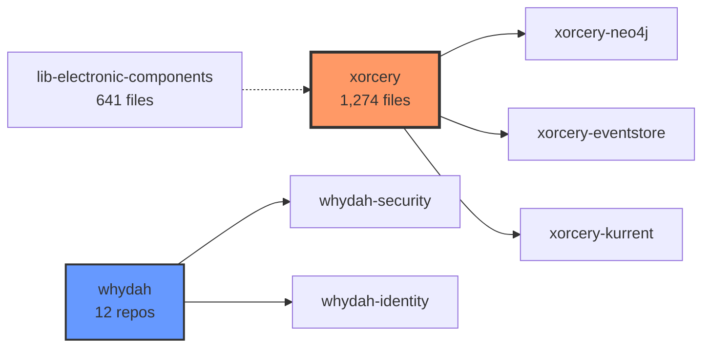
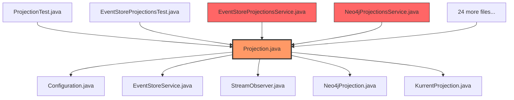
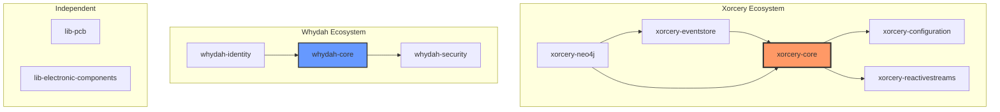

# Synthesis for Architects

**You manage 58 repositories with 429 cross-dependencies. Can you see them all right now?**

**📊 Visual Summary:** [Full Presentation](../visuals/engineering-omniscience-synthesis.pdf)

---

## The Architecture Visibility Problem

AI-augmented teams generate code across repositories faster than architecture governance can track. Your architecture diagrams were drawn 6 months ago. Since then, AI has helped your team create thousands of files across dozens of repos. The actual dependency graph has drifted from the documented one.

**What architects need but currently lack:**

| Need | Traditional Tool | Limitation |
|------|-----------------|------------|
| Cross-repo dependency map | Manual Confluence diagram | Stale within weeks |
| Impact analysis | IDE "Find Usages" | Single project only |
| Architecture drift detection | Manual review | Quarterly at best |
| Organizational structure mapping | Spreadsheets | Never current |
| Multi-format search | grep + Google Drive + Slack | Fragmented, slow |

**The core problem:** Your architecture decisions require understanding the *actual* dependency graph. But the actual graph lives in code across N repositories, and no single tool shows it.

---

## Synthesis as Architecture Intelligence

Synthesis indexes your entire codebase -- all repositories, all file types -- and builds a queryable knowledge graph with bi-directional relationship tracking.

### Capability 1: Module Dependency Graphs

Generate a high-level architecture view of your entire codebase automatically.

**Real example** (Cantara codebase, 58 repositories, validated Feb 14, 2026):

**What this reveals:**
- **Hub nodes:** Xorcery is the core framework (highest centrality) -- changing it has maximum blast radius
- **Clusters:** Whydah is a tightly coupled ecosystem (12 interconnected repos) -- treat as a unit for versioning
- **Isolated modules:** lib-electronic-components has minimal dependencies -- safe to modify independently

**Performance:** 58 nodes, 429 edges generated in 2.3 seconds.

### Capability 2: File-Level Impact Analysis

Before any architectural change, see exactly what depends on the component you are modifying.

**Real example** (Projection.java in Cantara codebase):

**Impact summary:**
- 5 outgoing dependencies (what Projection.java uses)
- 28 incoming references (what uses Projection.java)
- **Blast radius:** 28 files across 4 categories (services, tests, examples, integrations)

**Architectural decision support:** Before refactoring Projection.java, you know the exact scope. No surprises.

### Capability 3: Cross-Repository Dependency Mapping

For microservice architectures, see how services depend on each other across repository boundaries.

**Architectural insights from real data:**
- Xorcery-core is the foundational dependency -- version changes here ripple everywhere
- Whydah and Xorcery are loosely coupled ecosystems -- can evolve independently
- lib-pcb and lib-electronic-components are fully independent -- no cross-contamination risk

### Capability 4: Organizational Intelligence

Map not just code structure but organizational structure across your file system.

Synthesis auto-discovers:
- **Companies** from directory patterns (README.md, business/, clients/, products/)
- **Clients** with status detection (active, past, opportunity/prospect)
- **Products** and their relationships to codebases
- **Corporate hierarchy** (parent companies, subsidiaries)

Then enables organization-scoped search: filter results by company, client, or product.

---

## Integration Patterns for Architecture Governance

### Pattern 1: Architecture Decision Records + Synthesis

**Before deciding:** Search for all files affected by the proposed change.

**Workflow:** Architect proposes changing the authentication module. Before writing the ADR, run a search and relate to quantify the impact. The ADR now includes concrete data: "This change affects 28 files across 4 services, 12 tests, and 12 examples."

**Value:** ADRs backed by data, not estimates.

### Pattern 2: Refactoring Safety Net

**Before refactoring:** Generate the blast radius for every file being changed.

**Workflow:** Developer wants to refactor a shared service. Architect requires `relate` output attached to the PR. Reviewer can verify: "All 28 dependent files were updated. None missed."

**Value:** Zero-surprise refactoring. Dependency bugs caught before merge, not in production.

### Pattern 3: Onboarding via Generated Architecture

**For new team members:** Generate an architecture overview automatically from the actual code.

Instead of maintaining stale Confluence pages, generate a fresh architecture graph at any time. The graph reflects the code as it exists today, not as it was documented 6 months ago.

**Value:** Architecture documentation that is never stale because it is generated, not maintained.

### Pattern 4: Architecture Drift Detection

**Quarterly:** Generate the module graph and diff against the previous quarter.

**Questions to answer:**
- Is complexity increasing? (more nodes, more edges)
- Are we reducing coupling? (fewer cross-module edges)
- Are new modules properly integrated? (connected appropriately)
- Did unexpected dependencies appear? (architecture violations)

**Value:** Quantitative architecture health tracking over time.

---

## Technical Architecture of Synthesis

Architects want to know the tool is well-built before trusting it with their codebase analysis.

**Core stack:**
- **Indexing:** Apache Lucene (full-text search, relevance ranking)
- **Analysis:** Language-specific parsers for Java, Python, JS/TS, Go, Rust, Kotlin, Ruby, C/C++, Markdown, YAML
- **Relationships:** Bi-directional detection via import/reference parsing, computed incoming edges
- **Graphs:** GraphBuilder/GraphRenderer with Mermaid, PNG, SVG, DOT output
- **Media:** Bundled ffprobe for video metadata, Apache PDFBox for PDF text extraction
- **Storage:** Local `.synthesis/` directory, 2-5% overhead relative to indexed content

**Performance characteristics:**

| Metric | Measured Value | Industry Baseline |
|--------|---------------|-------------------|
| Indexing throughput | 258-300 files/sec | 50-150 files/sec |
| Index overhead | 2.7% | 10-20% |
| Search response | <1 sec (10,000 files) | 2-5 sec |
| Graph generation | 2.3 sec (58 nodes, 429 edges) | 10-30 sec |
| Incremental scan | 156-345 ms (1,000 files) | 2-5 sec |

**Security model:** All processing is local. Core features require no network access. AI features (optional) require explicit opt-in and an Anthropic API key; only selected files are sent to the API.

---

## Getting Started for Architecture Teams

**Step 1: Index your entire codebase (31 seconds for 7,990 files)**

One developer installs Synthesis and points it at your codebase root. All repositories under that root are indexed together.

**Step 2: Generate your first architecture graph**

Module-level dependency graph in Mermaid format. Embed it in your architecture documentation, wiki, or ADR template.

**Step 3: Share with your team**

The graph is a Mermaid markdown snippet -- paste it into any markdown-rendering tool (GitHub, GitLab, Confluence, Notion). Or export as SVG/PNG for presentations.

**Step 4: Integrate into your governance process**

Add `relate` output to PR requirements for shared components. Generate fresh architecture graphs quarterly. Diff them to detect drift.

**Total time to first architecture graph: under 5 minutes.**

---

**Related documentation:**
- **For developers on your team:** [Quick Start](../guides/QUICK-START.md) (5 min) | [Full User Guide](../guides/USER-GUIDE.md)
- **For your engineering managers:** [Manager Guide](./ENGINEERING-MANAGER.md) -- team adoption playbook and metrics
- **For executive justification:** [Executive Brief](./EXECUTIVE-BRIEF.md)
- **Full command reference:** [Project README](../../README.md)
